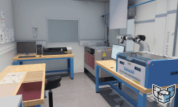

# Sample Projects
3D samples projects for [HARFANG](https://www.harfang3d.com) 3D and [HARFANG Studio](https://www.harfang3d.com/en_US/studio)

    

### Authors/artists

* Toyota 2JZ-GTE Engine by BlurRenderStudio (https://www.cgtrader.com/serhiidenysenko8256)
* Range Rover and (almost) Audi model by Dariusz Ślanda (https://www.cgtrader.com/polycraft)
* Science Lab 3D models by [Jean-Marie Lamarche](https://www.artstation.com/kaanlee), scene setup by Camille Dudognon, Movida Production (https://www.movida-prod.com/)
* Showroom ("Moody Lighting Art Gallery 2019") by Marcin Lubecki (https://sketchfab.com/3d-models/moody-lighting-art-gallery-2019-f72385d809234ac7b246ef704afd2c44)